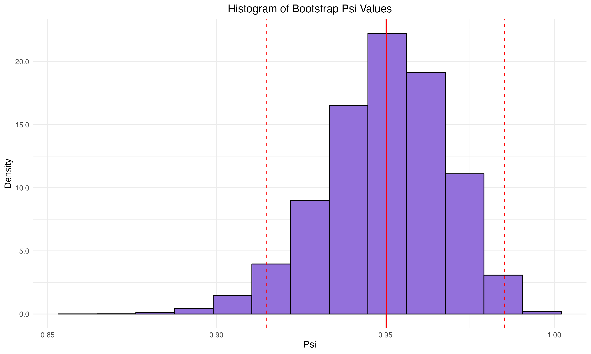
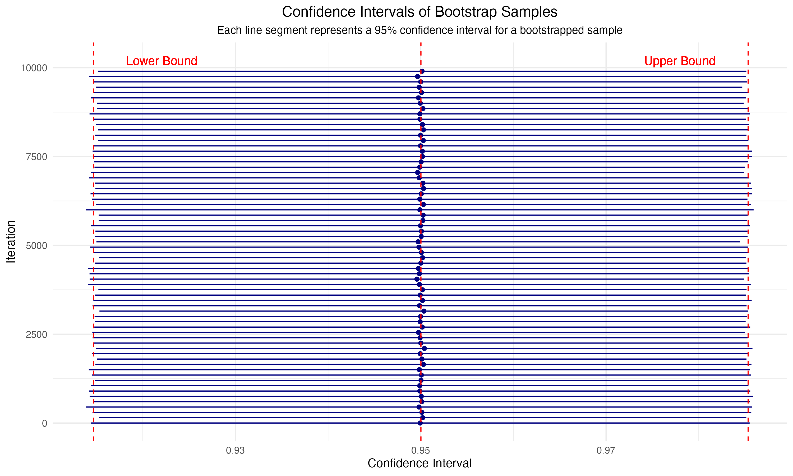

```{r setup, include=FALSE}
knitr::opts_chunk$set(warning = FALSE)
library(tidyverse)
library(maxLik)
library(reshape2)
library(fastR2)
```

# Abstract

The COVID-19 pandemic necessitated the development of effective vaccines to mitigate severe health outcomes. This study evaluates the efficacy of the Pfizer-BioNTech BNT162b2 mRNA vaccine using statistical methods such as maximum likelihood estimation (MLE), likelihood ratio tests, and bootstrapping. Analyzing data from a placebo-controlled study with 170 COVID-19 cases, we estimated the vaccine efficacy to be approximately 95%, significantly surpassing the FDA's minimum efficacy requirement of 30%. The MLE provided an efficacy estimate of 0.9506, with a 95% confidence interval ranging from 91.55% to 98.57%. Bootstrapping with 10,000 iterations confirmed the robustness of this estimate, yielding similar results with P-values equal to zero. Our findings demonstrate the vaccine's high effectiveness in preventing COVID-19.

# Keywords

Efficacy, Likelihood, COVID-19, Bootstrap, Estimators

# Introduction

The COVID-19 pandemic has impacted millions globally, since the World Health Organization declared it a global pandemic on March 11th, 2020. Sensitive groups are at high risk of COVID-19 and its complications. Moreover, recent studies have shown that long-term COVID-19 or post-COVID-19 symptoms make individuals more susceptible to additional health conditions like diabetes, heart conditions, and neurological conditions [@longcovid]. Therefore a safe and effective vaccine is imperative to global health. 

In December 2020, Pfizer and BioNTech received FDA Emergency Use Authorization for their two-dose BNT162b2 COVID-19 mRNA vaccine. The approval was based on a placebo-controlled, observer-blinded study involving participants aged 16 and older who were randomly assigned to receive either the placebo or the vaccine. The data provided leverage to prove that the BNT162b2 vaccine efficacy exceeds the FDA-required efficacy of 30% [@COVIDpaper].

Given the FDA's minimum efficacy requirement of 30%, this paper focuses on the statistical analysis of the vaccine's efficacy. We will utilize hypothesis testing, bootstrapping, and maximum likelihood estimation to evaluate the data. The thoroughness of this analysis is essential for ensuring reliable and valid findings, which will guide public health decisions based on robust evidence.


# Statistical Methods

The data for positive and negative tests between the placebo and vaccine groups is taken from the previous research on the vaccine efficacy [@COVIDpaper]:

\begin{table}[h]
    \centering
    \begin{tabular}{c|p{1in}|p{1in}|p{1in}}
    Test & Positive & Negative & Total \\ \hline
    Vaccine & 8 & 17403 & 17411 \\ \hline
    Placebo & 162 & 17349 & 17511 \\ \hline
    Total & 170 & 34752 & 34922 \\ \hline
    \end{tabular}
\end{table}

While this is a rather simple dataset, we can use a stacked bar plot to better visualize it:

```{r stacked barplot, echo = FALSE}
data <- read.csv("data.csv")
data_melted <- melt(data, id.vars = "Test")

ggplot(data_melted, aes(x = Test, y = value, fill = variable)) +
  geom_bar(stat = "identity") +
  geom_text(aes(label = value), 
            position = position_stack(vjust = 0.5)) +
  labs(x = "Test", y = "Number of Participants", 
       title = "COVID Infection for Vaccine and Placebo Groups") 
```

We denote the random variable $T$ as the number of vaccinated individuals from the 170 COVID cases.

\[ T \sim Binom(n = 170,\pi) \]

We can define $\pi = \textrm{P(Vaccine|COVID)} = \frac{\pi_1}{\pi_1 + \pi_2}$, given that the sample sizes for the vaccine and placebo groups are approximately equal. Here, $\pi_1$ is the proportion of vaccinated individuals who got COVID and $\pi_2$ is the proportion of unvaccinated individuals who got COVID. Moreover, we define the vaccine efficacy as $\psi = \frac{1-2\pi}{1-\pi}$ [@errorstatistics]. We can then formulate the following hypothesis test based on the FDA's suggested efficacy of at least 30%:

\[ H_0: \psi_0 = 0.3 \]
\[ H_1: \psi_0 \geq 0.3 \]

We will use a maximum likelihood estimator to conduct a likelihood ratio test as well as bootstrapped confidence intervals to test our hypothesis.

## Maximum Likelihood Estimator

The first method we used to analyze the BNT162b2 vaccine efficacy is maximum likelihood estimation. We found the maximum likelihood estimate for our efficacy parameter $\psi$, which we can call $\hat{\psi}^{mle}_0$. To calculate this estimator, we can first write the likelihood function of $\pi$ based on the PDF of $T$:


\[ L(\pi) = \binom{n}{t}\pi^t(1 - \pi)^{n - t} \]

Then we write $\pi$ in the form $\pi = g(\psi)$, given that $\psi = \frac{1 - 2\pi}{1 - \pi}$. We thus have that $\psi - \psi\pi = 1 - 2\pi$, which becomes $2\pi - \psi\pi = 1 - \psi$, which becomes:

\[ \pi = \frac{1 - \psi}{2 - \psi} \]

Because $\psi$ is the parameter we want to make our estimator,we can rewrite our likelihood function in terms of $\psi$, still based on the PDF of $T$ for $t_{obs} = 8$:

\[ L(\psi) = L(g(\psi)) = L\left(\frac{1 - \psi}{2 - \psi}\right) = \binom{n}{t}\left(\frac{1 - \psi}{2 - \psi}\right)^t\left(1 - \left(\frac{1-\psi}{2-\psi}\right)\right)^{n - t} = \binom{n}{t}\left(\frac{1 - \psi}{2 - \psi}\right)^t\left(\frac{1}{2 - \psi}\right)^{n - t} \]

Mathematically, it is difficult to do much with just this function, so we can log-transform it to convert it from a product to a sum. We can calculate the log-likelihood function for $\psi$ as shown here:

\[ \ell(\psi) = \ln(L(\psi) = \ln\left(\binom{n}{t}\right) + t\ln(1 - \psi) - t\ln(2 - \psi) - (n - t)\ln(2 - \psi) = \ln\left(\binom{n}{t}\right) + t\ln(1 - \psi) - n\ln(2 - \psi) \]

Our estimator is defined as where the log-likelihood function is maximized by the parameter $\psi$, and we can find this by computing $\underset{\psi}{\arg\max} \ \ell(\psi | t)$, or in other words, by taking the derivative of this function and setting it equal to 0. So we can calculate $\ell'(\psi) = 0$ here:

\[ \frac{d}{d\psi} \ell(\psi) = \frac{d}{d\psi} \ln\left(\binom{n}{t}\right) + \frac{d}{d\psi} t\ln(1 - \psi) - \frac{d}{d\psi} n\ln(2 - \psi) = \frac{n}{2 - \psi} - \frac{t}{1 - \psi} = 0 \]

We can then solve $\frac{n}{2 - \psi} = \frac{t}{1 - \psi}$. We get that $n - n\psi = 2t - t\psi$, which becomes $t\psi - n\psi = 2t - n$. Assuming that this critical point is a maximum, we have that our estimator estimator is $\widehat{\psi}^{mle}_0 = \frac{2t - n}{t - n}$. We cannot use the estimator on its own to make much inference about our hypothesis. However, e can use our MLE to perform a likelihood ratio test, defined as $W = 2\left(\ell\left(\hat{\psi}^{mle}_0\right) - \ell\left(\psi^{null}_0\right)\right)$. A small $W$ corresponds with statistical significance for rejecting the null hypothesis, and vice versa. For a sufficiently sized $n$, which we have as $n = 170$, the distribution $W \sim \chi^2_1$ holds, letting us compute a P-value for our hypothesis. We can compute this value of $W$ here as:

\[ W = 2\left(\left(\ln\left(\binom{n}{t}\right) + t\ln\left(1 - \widehat{\psi}^{mle}_0\right) - n\ln\left(2 - \widehat{\psi}^{mle}_0\right)\right) - \left(\ln\left(\binom{n}{t}\right) + t\ln\left(1 - \psi^{null}_0\right) - n\ln\left(2 - \psi^{null}_0\right)\right)\right)\]

This becomes:

\[ W = 2t\ln\left(1 - \widehat{\psi}^{mle}_0\right) - 2n\ln\left(2 - \widehat{\psi}^{mle}_0\right) - 2t\ln\left(1 - \psi^{null}_0\right) + 2n\ln\left(2 - \psi^{null}_0\right) \]

Finally, we can set up an equation to find a 95% confidence interval for our parameter $\psi$:

\[ \widehat{\psi}^{\text{mle}}_0 \pm 1.96 \sqrt{\frac{-1}{\ell''(\widehat{\psi}^{\text{mle}}_0)}} = \widehat{\psi}^{\text{mle}}_0 \pm 1.96 \sqrt{\frac{-1}{\frac{n}{(2 - \widehat{\psi}^{\text{mle}}_0)^2} - \frac{t}{(1 - \widehat{\psi}^{\text{mle}}_0)^2}}} \]

## Bootstrap

Bootstrapping is a versatile technique for estimating unknown quantities in statistical models, primarily used for determining standard errors, confidence intervals, and p-values for test statistics. As defined by Boos (2003), "The bootstrap is a general technique for estimating unknown quantities associated with statistical models" and "is typically used to estimate quantities associated with the sampling distribution of estimators and test statistics." Introduced by Efron in 1977, bootstrapping involves resampling from the data to create a "bootstrap world," where the data analyst can simulate any quantity of interest (Boos, 2003). This method is particularly valuable in complex models where traditional asymptotic approximations are challenging or unavailable, allowing statisticians to leverage computational power to replace intricate random variable calculus (Boos, 2003). The popularity and impact of bootstrapping extend beyond the statistics community, making it a fundamental tool in modern statistical inference (Boos, 2003).

In our analysis, bootstrapping is applied to estimate the efficacy of the BNT162b2 vaccine. By generating multiple resampled datasets from the original data, we can repeatedly calculate the vaccine efficacy and construct a distribution of these efficacy estimates. This distribution provides valuable insights into the range, variability, and confidence intervals of the vaccine's effectiveness. Using bootstrapping, we can assess the reliability of the observed efficacy, ensuring that the conclusions drawn from the data are well-supported by a rigorous statistical framework.

In this analysis, we conducted a bootstrap resampling procedure to evaluate the distribution of the psi values, a derived statistic from the proportions of COVID cases in vaccine and placebo groups. The bootstrap technique involves repeatedly sampling with replacement from the original data to create numerous simulated samples. This method helps in estimating the sampling distribution of the statistic of interest and provides insights into its variability and confidence intervals.

The proportions of COVID cases in each group `prop_vaccine` and `prop_placebo` were calculated using the provided data. 

\[ \textrm{Observed }\pi = \frac{\textrm{Observed }\pi_1}{\textrm{Observed }\pi_1 + \textrm{Observed }\pi_2} \]

Using these proportions, the observed psi value was computed using the formula:

\[ \textrm{Observed } \psi = \frac{1 - 2 \cdot \textrm{Observed } \pi}{1 - \textrm{Observed } \pi} \]

Where `observed_pi` (the variable in R) is the proportion of COVID cases in the vaccine group relative to the combined total of COVID cases in both groups.

A total of 10,000 bootstrap samples were generated. For each iteration, random samples were drawn with replacement from the `vaccine` and `placebo` groups based on their respective proportions. The bootstrap psi value was then calculated for each resampled dataset. This process generated a distribution of psi values, stored in `bootstrap_df`.


The summary statistics of the bootstrap distribution, including the mean, standard deviation, and 95% confidence intervals, were calculated. The critical values for the confidence intervals were determined using the quantiles of the normal distribution:

$$\text{Lower critical value} = E[\psi]- Z_{0.975} \times SD[\psi]$$

$$\text{Upper critical value} = E[\psi] + Z_{0.975} \times SD[\psi]$$

The analysis involved calculating the proportions of COVID cases $(\pi)$, deriving psi values from these proportions, and using the bootstrap method to generate 10,000 samples. This allowed for estimation of the mean, standard deviation, and 95% confidence intervals of the psi values.


# Results

For our MLE, we can plug in $t_{obs} = 8$ and $n = 170$ to $\widehat{\psi}^{mle}_0 = \frac{2t - n}{t - n}$, we get $\widehat{\psi}^{mle}_0 = \frac{16 - 170}{8 - 170} = \frac{77}{81} = `r round(77 / 81, 4)`$. We can also use the Newton Raphson method to estimate $\psi$ to get the same value, shown in the appendix.

For the likelihood ratio test, we can plug in our values $\widehat{\psi}^{mle}_0 = `r round(77 / 81, 4)`$, $\psi^{null}_0 = 0.3$, $t = 8$, and $n = 170$ to our W to get:

\[ W = 2(8)\ln\left(1 - `r round(77 / 81, 4)`\right) - 2(170)\ln\left(2 - `r round(77 / 81, 4)`\right) - 2(8)\ln\left(1 - 0.3\right) + 2(170)\ln\left(2 - 0.3\right) = 121.6012 \]

Given our sample size is large we know $W \sim \chi^2_1$. Therefore,  we can calculate P-value for our hypothesis as $P(W \geq 121.6012) = 0$. This P-value is zero, so we can reject the null hypothesis under our likelihood ratio test that the COVID-19 vaccine efficacy is 30%. 


Finally, we can use our MLE estimator to calculate a 95% confidence interval for $\psi$:

\[ 0.9506 \pm 1.96\sqrt{\frac{-1}{-3124.317}} = 0.9506 \pm 0.0351\]

We are 95% confident that the true efficacy of the BNT162b2 vaccine lies in the interval [91.55%, 98.57%]. This supports our findings in the likelihood ratio test. There is convincing evidence that the true efficacy exceeds the FDA-required efficacy of 30%. 

Furthermore, the vaccine efficacy ($\psi$) for the BNT162b2 vaccine was estimated using a bootstrap method with 10,000 iterations, ensuring accurate and stable estimates. The observed vaccine efficacy from the original data was calculated using the given formula, resulting in an estimated $\psi$ of approximately 95\%.

The bootstrap resampling provided a distribution of $\psi$ values, from which the mean efficacy was estimated to be 0.9508 with a standard deviation of 0.0178. The 95\% confidence interval for the vaccine efficacy, derived from the bootstrap samples, ranged from approximately 91.59\% to 98.58\%. This confidence interval is quite narrow, indicating a high level of precision in the efficacy estimate.



The histogram of the bootstrap $\psi$ values, along with the confidence intervals, confirms that the estimated efficacy is consistently around 95\%, supporting the robustness of the estimate. Furthermore, the probability that the vaccine efficacy exceeds 30\% is 1, with the calculated p-value being effectively zero ($2.6 \times 10^{-285}$). This overwhelming evidence suggests that the vaccine significantly reduces the risk of infection compared to the placebo.



In summary, the results from the bootstrap analysis strongly support the conclusion that the BNT162b2 vaccine is highly effective, with an estimated efficacy of around 95\%. The narrow confidence interval and extremely low p-value reinforce the reliability and significance of the vaccine's protective effect against COVID-19.


# Conclusion

In conclusion, we can say with great confidence that the Pfizer-BioNTech BNT162b2 COVID-19 vaccine is effective at preventing positive tests of the disease, as the vaccine efficacy is much greater than the FDA target value of 30%. With `r round(100 * (77 / 81), 2)`% efficacy (based off of the maxmimum likelihood estimator for our binomial distribution of positive tests), this COVID-19 vaccine should be recommend for general use for disease prevention. We conducted a variety of statistical testing to back up this claim, such as the likelihood ratio test and boostrapped efficacy paramters, which both netted extremely small P-values as well as tight confidence intervals around the estimate for the vaccine efficacy. Our results match the findings of other research on this vaccine's efficacy, where Bayesian estimates were used to show that the vaccine is sufficiently effective [@COVIDpaper]. Next steps for this research would be to utilize more estimators to reach this conclusion, such as the method of moments estimator as well as to corroborate the previous research using Bayesian methods, such as the Beta Binomial model. Other next steps would be to use these methods to identify vaccine efficacy in vaccines for other diseases, especially newly developed ones.

# References

<div id="refs"></div>

# Appendix

## Visualizations

```{r read data, echo = FALSE}
data <- read.csv("data.csv")
data_melted <- melt(data, id.vars = "Test")
```

### Stacked Barplot Code

```{r stacked barplot code, fig.show = "hide"}
ggplot(data_melted, aes(x = Test, y = value, fill = variable)) +
  geom_bar(stat = "identity") +
  geom_text(aes(label = value), 
            position = position_stack(vjust = 0.5)) +
  labs(x = "Test", y = "Number of Participants", 
       title = "COVID Infection for Vaccine and Placebo Groups") 
```

## Newton Rhapson MLE Approximation

```{r newton rhapson, echo= TRUE}
loglik <- function(psi, T, n){
  if (psi > 1 | psi < 0) 
    return(NA)
  else
    return(log(choose(n, T)) + (T * log(1 - psi)) - (n * log(2 - psi)))
}

estimation <- maxLik2(loglik = loglik, start = 0.55, method = "NR", tol = 1e-4, 
                      T = 8, n = 170)

print(estimation)

plot(estimation) +
    labs(title = "Second order approximation to the Log-Likelihood Function", 
         x = expression(psi))
```

## Likelihood Ratio Test Calculation

```{r likelihood ratio test, echo = TRUE}
W = (2 * 8 * log(1 - (77 / 81))) - (2 * 170 * log(2 - (77 / 81))) -
    (2 * 8 * log(1 - 0.3)) + (2 * 170 * log(2 - 0.3))

p_value <- pchisq(q = W, df = 1, lower.tail=F)
```

Here, $W$ is `r round(W, 4)` and the corresponding P-value is `r p_value`.

## MLE Confidence interval calculation
```{r mle confidence inteval, echo = TRUE}

se <- sqrt(-1 / ((170 / (2 - 0.9506)^2) - (8 / (1 - 0.9506)^2)))

upper_lim <- 0.9506 + 1.96 * se
lower_lim <- 0.9506 - 1.96 * se

```

The calculated confidence interval is [0.9155, 0.9856] with a standard error of `r round(se,4)`.

## Bootstrap

```{r}

data <- read_csv("data.csv", show_col_types = F)

library(boot)
library(readr)
library(tidyverse)

```

```{r}

vaccine <- data %>%
  filter(Test == "Vaccine")

placebo <- data %>%
  filter(Test == "Placebo")

prop_vaccine <- vaccine$COVID / (vaccine$COVID + vaccine$No_COVID)
prop_placebo <- placebo$COVID / (placebo$COVID + placebo$No_COVID)

observed_pi <- prop_vaccine/(prop_vaccine + prop_placebo)

observed_psi <- (1 - 2*observed_pi)/(1 - observed_pi)

```

```{r}

n_bootstrap <- 10000
bootstrap_psis <- numeric(n_bootstrap)
set.seed(123)

for (i in 1:n_bootstrap) {
  vaccine_sample <- sample(c(0, 1), size = vaccine$COVID + vaccine$No_COVID, replace = TRUE, prob = c(1 - prop_vaccine, prop_vaccine))
  placebo_sample <- sample(c(0, 1), size = placebo$COVID + placebo$No_COVID, replace = TRUE, prob = c(1 - prop_placebo, prop_placebo))
  
  prop_vaccine_boot <- mean(vaccine_sample)
  prop_placebo_boot <- mean(placebo_sample)
  
  bootstrap_pi <- prop_vaccine_boot / (prop_vaccine_boot + prop_placebo_boot)
  
  bootstrap_psis[i] <- (1 - 2 * bootstrap_pi) / (1 - bootstrap_pi)
}

```

```{r}

bootstrap_df <- data.frame(psi = bootstrap_psis)

bootstrap_summary <- bootstrap_df %>%
  summarise(n = n(), 
            mean = mean(psi), 
            sd = sd(psi), 
            lower_critical_value = mean - qnorm(0.975)*sd, 
            upper_critical_value =  mean + qnorm(0.975)*sd)

lower_critical_value <- bootstrap_summary$lower_critical_value
upper_critical_value <- bootstrap_summary$upper_critical_value

bootstrap_summary

```

```{r}

p_val <- pnorm(0.3, mean = bootstrap_summary$mean, sd = bootstrap_summary$sd, lower.tail = T)

emp_p_val <- length(bootstrap_df[bootstrap_df$psi <= 0.3])/length(bootstrap_df$psi)

cat("Estimated p-value:", p_val, "\n")

cat("Empirical p-value:", emp_p_val, "\n")

```
